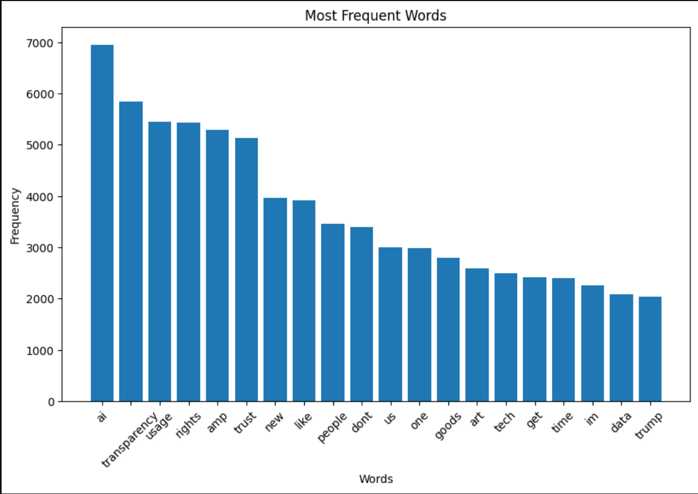
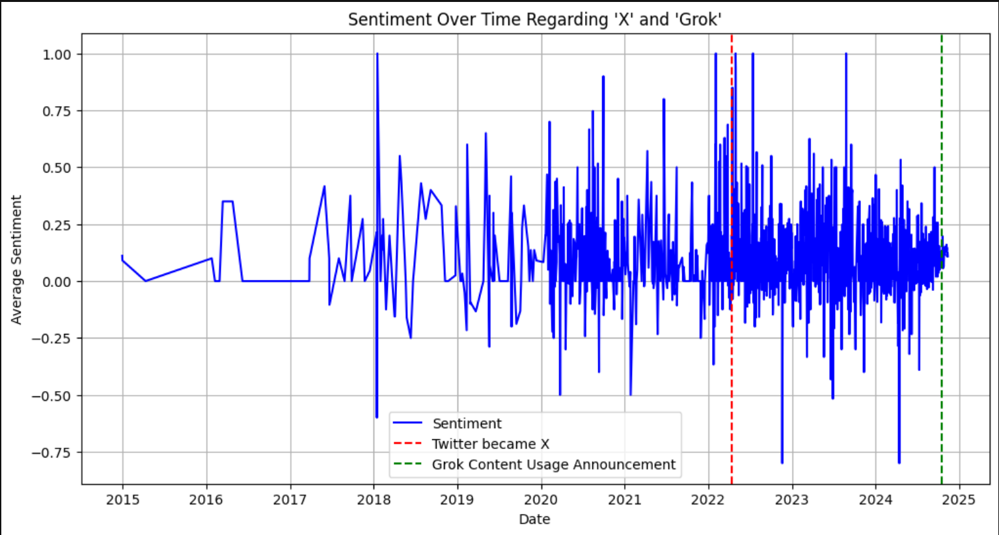
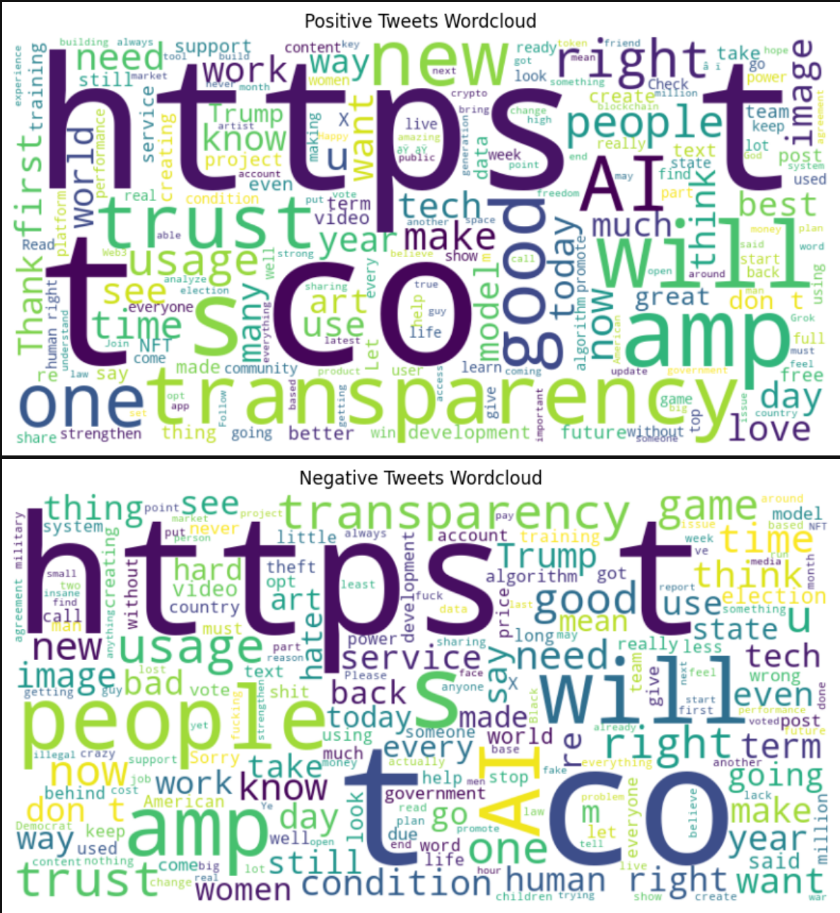
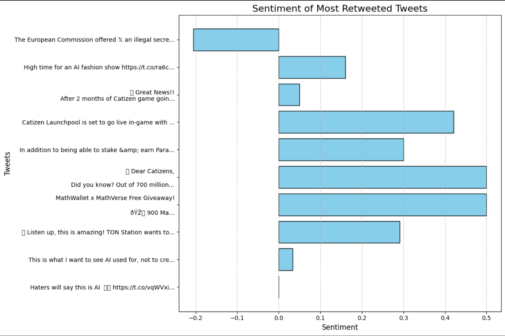

# comp3800f24_project
Twitter(X) Data Project
This project involves analyzing tweets to uncover insights, trends, and predictive patterns using natural language processing and machine learning techniques. The purpose of the project is to apply data analytics methodologies to a real-world dataset and derive actionable insights. Key findings include sentiment trends over time and a model to predict retweet counts based on tweet content.

---

## Jupyter Notebook

The analysis and code are available in the [notebook.ipynb](notebook.ipynb).

---

## Data

### **Data Collection**
- The data was collected using Apify to scrape tweets from X (formerly Twitter). 
- **Total Spent:** $78.12
- Keywords used for scraping are listed in the `keywords.csv` file.

### **Dataset Used**
- **Source:** The dataset, `comp3800f24_tweets.csv`, includes tweets collected via scraping.
- **Size:** 
  - **Dimensions (m, n):** (57144, 20).
  - **Storage:** ~20 MB.

### **Preprocessing**
- Removed non-tweet data (`type` != "tweet").
- Retained only the following columns for analysis:
  - `id`, `url`, `twitterUrl`, `text`, `source`, `retweetCount`, `replyCount`, `likeCount`, `quoteCount`, `viewCount`, `createdAt`, `lang`, `bookmarkCount`, `isReply`, `inReplyToId`, `conversationId`, `inReplyToUsername`, `isPinned`, `isRetweet`, `isConversationControlled`.
- Applied tokenization, stop-word removal, and special character cleaning for text analysis.

---

## Prediction Analysis
Hypothesis Creation:
We selected a regression problem to predict retweetCount based on the text content of tweets. This aligns with the idea of determining if the text features (processed through TF-IDF) have predictive power for the popularity of a tweet.

Exploratory Data Analysis (EDA):
A correlation analysis wasn't explicitly included in the script, but numeric features like retweetCount, likeCount, replyCount, etc., could be examined for correlations to guide feature selection. PCA was applied to text data for dimensionality reduction, ensuring manageable input size for modeling.

Feature Engineering:
Text data from the text column was vectorized using the TF-IDF scheme, transforming it into a matrix of 1000 features (specified in TfidfVectorizer(max_features=1000)).
PCA reduced the dimensionality of the TF-IDF matrix to 50 components, making it more computationally efficient.

Model Training:
A Random Forest Regressor was chosen as the predictive model. This algorithm is robust and handles high-dimensional data effectively without requiring extensive preprocessing. We split the data into training and testing sets (80% training, 20% testing) using train_test_split.

Model Evaluation:
Predictions were generated on the test set using the trained Random Forest model.
The Mean Squared Error (MSE) was calculated to assess model performance. This is a standard metric for regression tasks, indicating how close the predictions are to the actual retweetCount.

Model Evaluation:
Predictions were generated on the test set using the trained Random Forest model.
The Mean Squared Error (MSE) was calculated to assess model performance. This is a standard metric for regression tasks, indicating how close the predictions are to the actual retweetCount.

### **Visualizations**
#### **Plot 1:** Most Frequent Words

- A bar plot showcasing the 20 most frequently occurring words in the dataset.

#### **Plot 2:** Sentiment Trends Over Time

- A line plot showing the average sentiment of tweets over time with annotations for key dates.

#### **Plot 3:** Wordcloud of Positive and Negative Tweets

- Visual representation of the most common words in positive and negative tweets:
  
#### **Plot 4:** Sentiment of Most Retweeted Tweets

- Horizontal bar plot showing the sentiment polarity of the 10 most retweeted tweets.

--

## Results

Mean Squared Error: 13428388.757485135

Large Errors in Prediction:
The model is likely struggling to make accurate predictions of retweetCount. This could mean that the relationship between the text features (extracted using TF-IDF and reduced with PCA) and the retweetCount is not strong or is too complex for the model to capture effectively.

Skewness of retweetCount:
Retweet counts often follow a highly skewed distribution (e.g., most tweets have few retweets, while a few go viral with thousands or millions). Such skewness can make predictions challenging and inflate error metrics. Consider normalizing or transforming retweetCount (e.g., using a log transformation) to make it more uniform.

Insufficient Features:
Only text data was used for predictions. Additional features, such as likeCount, replyCount, or metadata about the author or timing of the tweet, could significantly improve the model’s ability to explain retweetCount.

Dimensionality Reduction Effect:
While PCA reduces the dimensionality of text features, it may discard information critical to predicting retweetCount. Testing with and without PCA or adjusting the number of components could help.

Model Complexity:
Random Forest models work well with tabular data but may not fully capture the subtleties of text data without engineered features. Other models, such as Gradient Boosting (e.g., XGBoost) or deep learning models, might perform better.

Noise in the Data:
There could be significant noise or randomness in how retweetCount is determined. Factors like user reach, time of posting, or external trends (not captured in the dataset) may contribute heavily to retweet popularity.

---

## Future Work
Data Preprocessing:
Apply a log transformation to retweetCount to mitigate the effect of outliers or skewed distribution.
Scale or normalize the numerical features to ensure they are on comparable scales.

Feature Engineering:
Incorporate additional features like likeCount, quoteCount, and viewCount, which are likely correlated with retweetCount.
Use metadata like createdAt (day/time of the tweet) or lang to capture contextual information.

Model Improvements:
Experiment with other models like XGBoost, CatBoost, or a neural network for text and numeric feature integration.
Use more advanced text embeddings (e.g., Word2Vec, FastText, or transformer-based embeddings like BERT) instead of TF-IDF.

---

## How to Run

1. Clone the repository:
   ```bash
   git clone https://github.com/jh00291/comp3800f24_project.git

2. Navigate (cd) to the directory.
3. Enter the command: jupyter notebook
4. Select the project and click run all cells.
